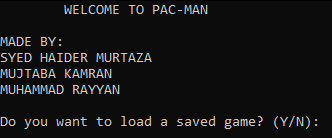
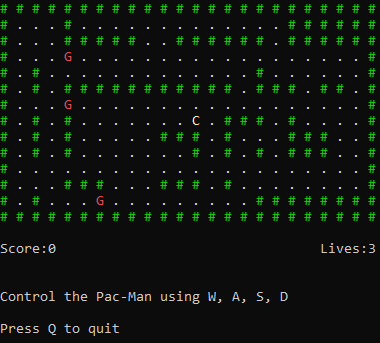
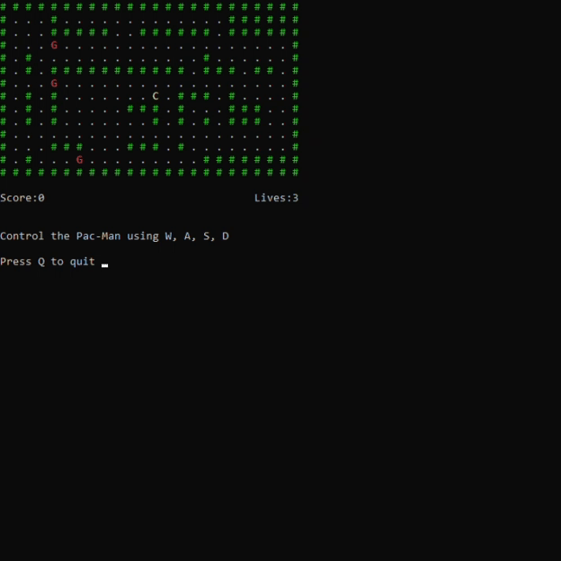

# Pac-Man Game

Welcome to the Pac-Man Game! This classic arcade-style game is implemented in C, featuring ghosts, pellets, and walls for an engaging gameplay experience. You control Pac-Man to collect all the pellets while avoiding ghosts. Enjoy the nostalgia!



## Project Background

This Pac-Man game was developed as part of a first semester project for the course "Programming Fundamentals" at FAST NUCES Karachi. The project aimed to apply fundamental programming concepts and techniques learned during the course.

## Features

- **Classic Gameplay**: Move Pac-Man using `W`, `A`, `S`, and `D` keys.
- **Ghosts**: Randomly moving ghosts add challenge.
- **Pellets**: Collect all pellets to win.
- **Scoring**: Keep track of your score and lives.
- **Saving/Loading**: Save your game and load it later.



## How to Play

1. **Controls**:
   - `W`: Move Up
   - `A`: Move Left
   - `S`: Move Down
   - `D`: Move Right
   - `Q`: Quit Game

2. **Objective**: Collect all pellets without getting caught by ghosts to win the game.

3. **Game Over**: The game ends when you run out of lives or collect all pellets.

4. **Saving**: Press `Q` and choose to save the game before quitting.



## Installation

To compile and run the game, follow these steps:

1. **Clone the repository**:

    ```bash
    git clone https://github.com/FAST-Dev-Team-Semester-Projects/Pac-Man-Game.git
    ```

2. **Navigate to the project directory**:

    ```bash
    cd Pac-Man-Game
    ```

3. **Compile the code**:

    ```bash
    gcc -o pacman src/pacman.c
    ```

4. **Run the game**:

    ```bash
    ./pacman
    ```

## Code Overview

### Global Variables

Here's a brief overview of the global variables used in the game:

1. **pacmanX & pacmanY**: Pac-Man's coordinates.

2. **score**: Player's current score.

3. **lives**: Player's remaining lives.

4. **pacmanFlag**: Track Pac-Man's visited positions.

5. **ghostsLoaded**: Indicates if ghosts were loaded from a saved game.

### Structures

The game utilizes a simple structure to represent ghosts:

```c
struct Ghost
{
    int x;
    int y;
} ghosts[TOTAL_GHOSTS];
```

### Functions

Here's a high-level overview of the key functions used in the game:

1. `incrementScore(int *score)`: Increases score by 1.

2. `decrementLive(int*lives)`: Decreases lives by 1.

3. `setTextColor(int color)`: Sets text color using Windows API.

4. `displayMap(char map[ROWS][COLUMNS], int *pacmanX, int*pacmanY)`: Displays the game map.

5. `initialisePellets(char map[ROWS][COLUMNS])`: Initializes pellets on the map.

6. `movePacman(char map[ROWS][COLUMNS], int *pacmanX, int*pacmanY, char direction)`: Handles Pac-Man's movement and collision.

7. `initialiseGhosts(char map[ROWS][COLUMNS], int pacmanX, int pacmanY)`: Initializes ghosts.

8. `ghostsMovement(char map[ROWS][COLUMNS], int *pacmanX, int*pacmanY)`: Handles ghosts' movement.

9. `saveGame(char map[ROWS][COLUMNS])`: Saves game state to a file.

10. `loadGame(char map[ROWS][COLUMNS])`: Loads a saved game from a file.

### Example Code Snippets

Here's a quick look at some of the core game functions. For full code, please check the source file [pacman.c](https://github.com/FAST-Dev-Team-Semester-Projects/Pac-Man-Game/blob/main/src/pacman.c).

#### Increment Score Function

```c
void incrementScore(int *score) {
    *score = *score + 1;
}
```

#### Move Pacman Function

```c
void movePacman(char map[ROWS][COLUMNS], int *pacmanX, int *pacmanY, char direction) {
    int x = *pacmanX;
    int y = *pacmanY;
    map[x][y] = ' '; // Clear the current position of Pacman

    switch (direction) {
    case 'w':
    case 'W':
        if (map[x - 1][y] != '#')
            *pacmanX = x - 1;

        if (map[*pacmanX][*pacmanY] == 'G') {
            decrementLive(&lives);
            *pacmanX = ROWS / 2;
            *pacmanY = COLUMNS / 2;
        } else if (map[*pacmanX][*pacmanY] == '.')
            incrementScore(&score);

        pacmanFlag[*pacmanX][*pacmanY] = 1;
        map[*pacmanX][*pacmanY] = 'C';
        break;

    // Handle other cases...
    }
}
```

## License

This project is licensed under the MIT License - see the [LICENSE](LICENSE.txt) file for details.

## Acknowledgements

Special thanks to the creators of the original Pac-Man game for the inspiration.

## Contact

For any questions or feedback, please contact:

- **Syed Haider Murtaza** at [haidermurtaza16@gmail.com](mailto:haidermurtaza16@gmail.com)
- **Muhammad Rayyan** at [imuhammadrayyan@gmail.com](mailto:imuhammadrayyan@gmail.com)
- **Mujtaba Kamran** at [mujtaba.kamran2004@gmail.com](mujtaba.kamran2004@gmail.com)
